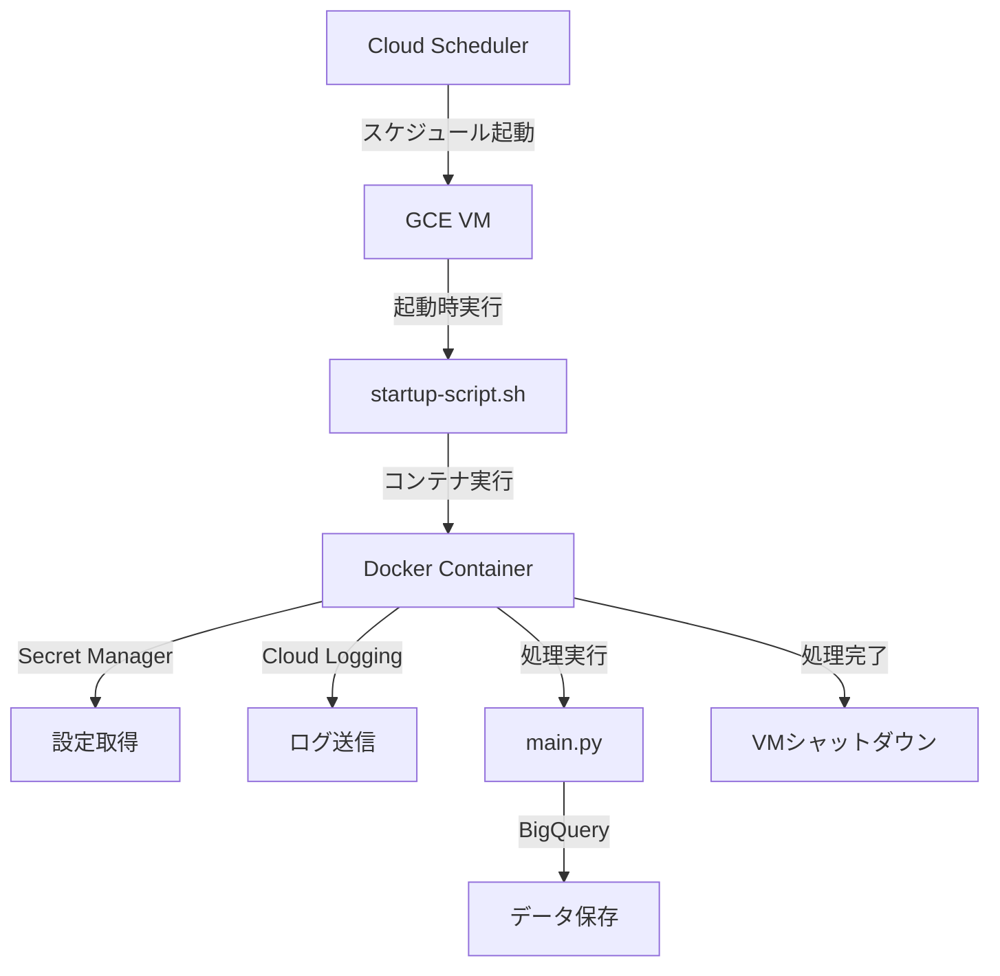

# GCE定期実行環境構築計画

## 概要

Google Search Consoleデータ取得アプリケーションをGCE環境で定期実行できるようにします。Playwrightは使用せず、PythonアプリケーションをDockerコンテナ化し、「スケジュール起動 → 処理実行 → 自動シャットダウン」のサイクルを構築します。

## アーキテクチャ



## 実装内容

### 1. Dockerfileの作成

- **ファイル**: `Dockerfile`
- Python 3.11ベースイメージを使用
- 依存関係のインストール（requirements.txt）
- アプリケーションコードのコピー
- エントリーポイントの設定

### 2. Secret Manager連携の実装

- **ファイル**: `src/utils/secret_manager.py`（新規作成）
- Secret Managerから設定を取得するユーティリティ
- `settings.ini`と`secrets.env`の代替として使用
- 既存の`EnvironmentUtils`と統合

### 3. Cloud Logging設定の追加

- **ファイル**: `src/utils/logging_config.py`（修正）
- Cloud Loggingハンドラーの追加
- 既存のファイルログと併用

### 4. GCE起動スクリプトの作成

- **ファイル**: `gce/startup-script.sh`
- Dockerコンテナの実行
- 処理完了後のVMシャットダウン
- エラーハンドリング

### 5. デプロイ用スクリプトの作成

- **ファイル**: `gce/deploy.sh`
- Artifact Registryへのイメージプッシュ
- GCE VMインスタンスの作成/更新
- インスタンススケジュールの設定

### 6. 設定ファイルの更新

- **ファイル**: `config/settings.ini`（必要に応じて修正）
- Secret Manager用の設定項目の追加

### 7. ドキュメントの作成

- **ファイル**: `docs/gce_setup.md`
- セットアップ手順
- Secret Managerへのシークレット登録方法
- トラブルシューティング

## 運用フロー

### 初回セットアップ時（ローカルPC）

1. Dockerイメージをビルド（`docker build`）
2. Artifact Registryにプッシュ（`docker push`）
3. GCE VMインスタンスを作成
4. Cloud Schedulerでスケジュール設定
5. **この後、ローカルPCのDockerは停止して問題ありません**

### 定期実行時（GCE上で自動実行）

1. Cloud Schedulerが指定時刻にVMを起動
2. VM起動時に`startup-script.sh`が自動実行
3. スクリプトがArtifact Registryからイメージを取得
4. Dockerコンテナを実行して処理を実施
5. 処理完了後にVMが自動シャットダウン
6. **ローカルPCは一切不要**

### コード更新時（ローカルPC）

1. コードを修正
2. Dockerイメージを再ビルド
3. Artifact Registryに再プッシュ
4. 次回のスケジュール実行時に新しいイメージが使用される
5. **更新作業時のみローカルPCのDockerが必要**

## 技術的な考慮事項

### 認証

- サービスアカウントJSONファイルをコンテナに含める
- GCEのデフォルトサービスアカウントにSecret Manager読み取り権限を付与

### 設定管理

- Secret Managerに以下を保存：
- `settings.ini`の内容
- `secrets.env`の内容
- サービスアカウントJSON（オプション）

### ログ

- Cloud Loggingに送信（構造化ログ）
- ローカルファイルにも保存（デバッグ用）

### コスト最適化

- 処理完了後にVMを自動シャットダウン
- 最小限のマシンタイプを使用（e2-micro推奨）
- プリエンプティブルVMの使用を検討

## ファイル構成

```javascript
BQ_gsc/
├── Dockerfile                    # 新規作成
├── .dockerignore                # 新規作成
├── gce/
│   ├── startup-script.sh       # 新規作成
│   └── deploy.sh               # 新規作成
├── src/
│   └── utils/
│       └── secret_manager.py   # 新規作成
├── docs/
│   └── gce_setup.md            # 新規作成
└── requirements.txt            # 必要に応じて更新（google-cloud-secret-manager追加）
```

## 実装順序

1. Secret Manager連携の実装
2. Cloud Logging設定の追加
3. Dockerfileの作成
4. GCE起動スクリプトの作成
5. デプロイスクリプトの作成